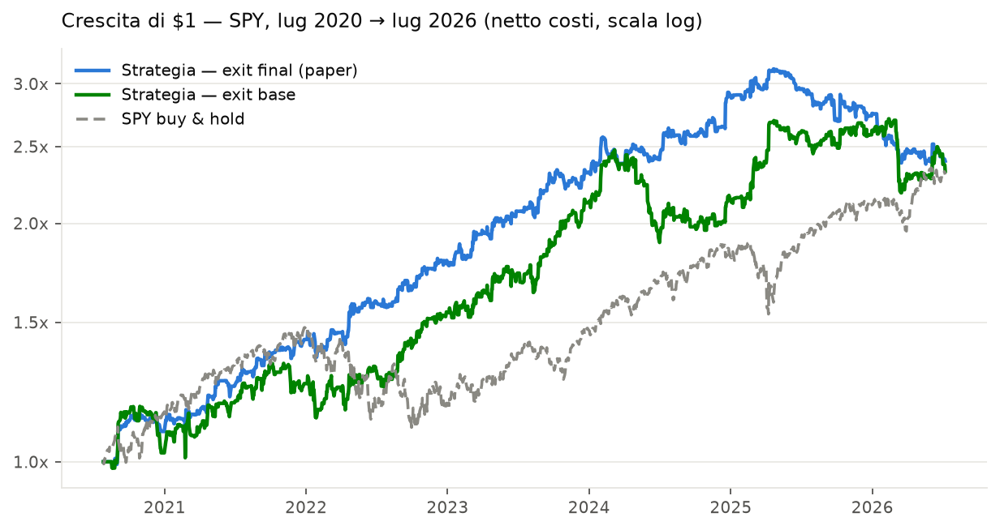
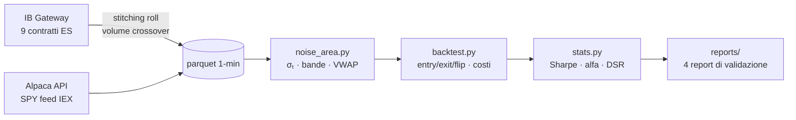
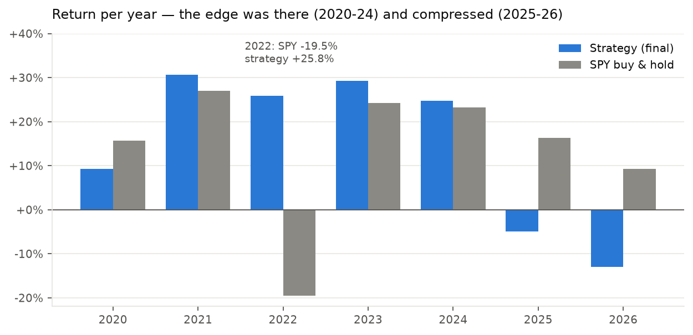
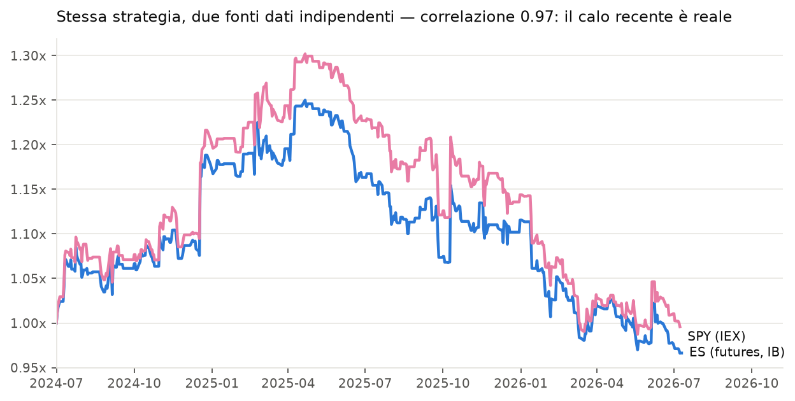
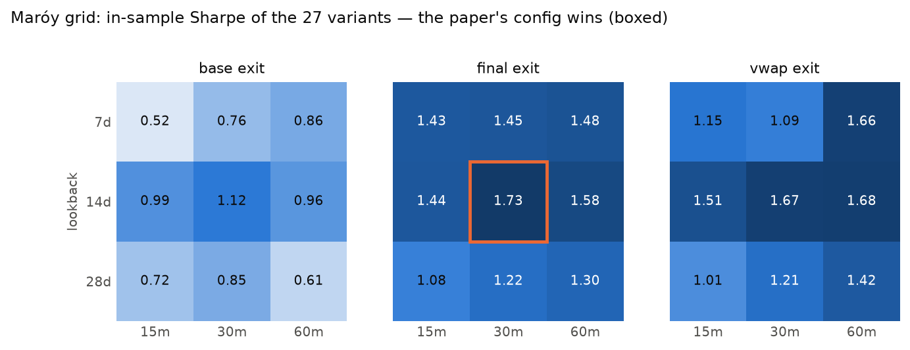
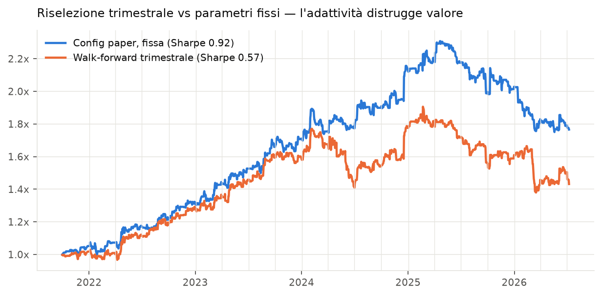

# 📈 Replica "Beat the Market" — Intraday Momentum su SPY & ES

[](https://www.python.org/)
[](tests/)
[](#-dati)
[](docs/CONCLUSIONS.md)

Replica indipendente e validazione di **Zarattini, Aziz & Barbon (2024)** — *"Beat the Market: An Effective Intraday Momentum Strategy for S&P500 ETF (SPY)"* ([SSRN 4824172](https://papers.ssrn.com/sol3/papers.cfm?abstract_id=4824172)) — su **due strumenti e due fonti dati indipendenti**, con protocolli anti-overfitting congelati ex-ante.



## 🎯 TL;DR

| | Risultato | Benchmark |
|---|---|---|
| ✅ **Replica riuscita** | Sharpe **1.11**, alfa **+16.7%**/anno (t 2.85), beta ≈ 0 | paper: 1.33, ~19.6% (2007-24) |
| ✅ **Trade-level in linea** | +2.6 bps/trade, WR 41%, payoff 1.69 | Quantitativo su ES: +2 bps, 36%, 2.1 |
| ✅ **Cross-validazione** | ES (futures IB) vs SPY (Alpaca): correlazione **0.97** | stessi segnali, due mondi dati |
| ⚠️ **Edge compresso dal 2025** | Sharpe recente ≈ 0 su *entrambi* gli strumenti | non è il feed, non sono i costi |
| 🔒 **L'ottimizzazione non salva** | Griglia 27 varianti: vince la config del paper; walk-forward: **distrugge** valore | protocolli ex-ante in [`docs/`](docs/) |

> **Giudizio sintetico**: strategia reale nel campione, profilo prezioso (beta 0, rende nelle crisi — 2022: **+25.8%** con SPY a -19.5%), ma edge attualmente compresso. Non allocabile oggi, non liquidabile come morta: verdetto completo in [`docs/CONCLUSIONS.md`](docs/CONCLUSIONS.md).

## 📐 La strategia in 30 secondi

Momentum intraday condizionato da una **"Noise Area"**: bande attorno all'open costruite dal movimento tipico degli ultimi 14 giorni *a ogni minuto della sessione*, ancorate a `max/min(Open, Close precedente)` per gestire i gap overnight. Prezzo dentro le bande = rumore, nessun trade. Breakout a un check di 30 minuti → trend-following con trailing stop su VWAP/bande, flat forzato alle 16:00. Vol targeting 2%/giorno, leva max 4×.



## 📊 I risultati chiave in quattro grafici

### 1 · L'edge c'era, e si è compresso



2020-2024: Sharpe 1.4–2.0 ogni anno, alfa 23-28%. Poi due anni sotto zero. Il 2022 è la firma del profilo "long volatility": la strategia guadagna proprio quando il mercato crolla.

### 2 · Il calo recente è reale — non è un artefatto dei dati



Stessa strategia su **ES** (futures CME via IB, VWAP e volumi veri, contratto continuo costruito con roll al volume crossover) e su **SPY** (feed IEX gratuito): rendimenti correlati **0.97**, stesso esito. Esclusi feed, costi (~0.4 bps/round trip) e stitching. → [`reports/validation_es.md`](reports/validation_es.md)

### 3 · Non è un problema di parametri



Il follow-up di Maróy (2025) dichiarava Sharpe >3 ottimizzando i parametri. Rifatto **con disciplina** (protocollo congelato [prima dei risultati](docs/PROTOCOL_MAROY.md), selezione meccanica, Deflated Sharpe Ratio): il vincente in-sample delle 27 varianti è… **la configurazione originale del paper** (final / 14g / 30min, riquadro). Nessuna variante promossa. → [`reports/maroy_experiment.md`](reports/maroy_experiment.md)

### 4 · Nemmeno l'adattività: il walk-forward distrugge valore



Riselezione trimestrale della variante migliore su Sharpe trailing 252g: **Sharpe 0.57 vs 0.92** della config fissa, 14 switch su 19, e la config migliore full-sample non viene selezionata *in nemmeno un trimestre* — la classifica a 1 anno tra varianti correlate è rumore. → [`reports/walkforward_experiment.md`](reports/walkforward_experiment.md)

## 🗂 Struttura

```
├── src/
│   ├── noise_area.py        # σₜ, bande con ancoraggio gap, VWAP di sessione
│   ├── backtest.py          # engine event-driven: entry/exit/flip, costi azioni+futures
│   ├── sizing.py            # vol targeting 2% + cap leva 4× (parametri congelati)
│   ├── stats.py             # Sharpe, alfa/beta, trade stats, Deflated Sharpe Ratio
│   ├── download_alpaca.py   # SPY 1-min (feed IEX, gratuito)
│   ├── download_ib.py       # ES 1-min: contratti trimestrali + stitching + back-adjust
│   ├── validate_data.py     # sanity check dati
│   └── run_{validation,maroy,walkforward}.py   # pipeline riproducibili → reports/
├── tests/                   # 48 test su dati sintetici (σₜ, gap, flip, exit, stitching…)
├── reports/                 # risultati: validazione SPY, ES, Maróy, walk-forward
├── docs/                    # SPEC, protocolli ex-ante congelati, CONCLUSIONS
├── scripts/make_charts.py   # rigenera i grafici del README (temi chiaro/scuro)
└── data/                    # roll table ES + VIX (i parquet 1-min si rigenerano con gli script)
```

## 🚀 Quickstart

```bash
pip install -r requirements.txt
python -m pytest tests/                      # 48 test, dati sintetici (nessun dato esterno)

# 1 · Scarica i dati — i file 1-min grezzi NON sono nel repo (ToS IB/CME e Alpaca)
export ALPACA_API_KEY=... ALPACA_SECRET_KEY=...          # account paper gratuito
python -m src.download_alpaca --symbol SPY --start 2016-01-01   # SPY, gratis
python -m src.download_ib --port 4001                          # ES, richiede IB Gateway + sub CME

# 2 · Pipeline di validazione riproducibili → reports/
python -m src.run_validation && python -m src.run_maroy && python -m src.run_walkforward

# 3 · Backtest ES (dopo download_ib)
python - <<'PY'
import pandas as pd
from src.backtest import run_backtest, CostModel
from src.stats import performance_summary, trade_stats

bars = pd.read_parquet("data/es_1min.parquet")
res = run_backtest(bars, exit_mode="final", costs=CostModel.es_futures(0.25),
                   unit_multiplier=50.0, initial_equity=1_000_000.0)
print(performance_summary(res.daily_returns))
print(trade_stats(res.trades, unit_multiplier=50.0))
PY
```

## 📚 Dati

| Fonte | Strumento | Periodo | Note |
|---|---|---|---|
| Interactive Brokers | ES futures, 1-min | mag 2024 → lug 2026 | 9 contratti trimestrali, roll al volume crossover, back-adjust additivo ([roll table](data/es_1min_rolls.csv)) |
| Alpaca (IEX, free) | SPY, 1-min | lug 2020 → lug 2026 | ~3% del volume consolidato: VWAP approssimato (validato vs ES: irrilevante) |
| CBOE | VIX daily | 1990 → oggi | tabelle per regime di volatilità |

> ⚠️ **I file 1-min grezzi non sono ridistribuiti** (ToS di IB/CME e Alpaca): si rigenerano con `download_ib.py` (ES, richiede account IB + sottoscrizione CME) e `download_alpaca.py` (SPY, chiave paper gratuita). Il repo include solo la [roll table](data/es_1min_rolls.csv) ES e il VIX (redistribuibile da CBOE).

## 🧭 Metodo anti-overfitting

Tutti i parametri della replica sono **congelati da spec** (lookback 14g, check 30min, vol target 2%, leva 4×). Ogni esperimento oltre la replica ha seguito lo stesso rituale, verificabile nella cronologia git:

1. 📝 **Protocollo congelato e committato prima di qualsiasi risultato** (lista chiusa di varianti, criteri di successo, regole di selezione meccaniche)
2. 🧪 Esecuzione una sola volta, out-of-sample valutato una sola volta
3. 📉 Correzione per test multipli (Deflated Sharpe Ratio, Bailey & López de Prado 2014)
4. 📢 Pubblicazione di *tutti* i risultati, inclusi i fallimenti

## ⚠️ Disclaimer

Progetto di ricerca personale a scopo educativo. Nessun contenuto costituisce consulenza finanziaria; i risultati passati (e le repliche di paper) non predicono rendimenti futuri. Il campione recente mostra un edge compresso: vedi [`docs/CONCLUSIONS.md`](docs/CONCLUSIONS.md) prima di trarre conclusioni operative.
