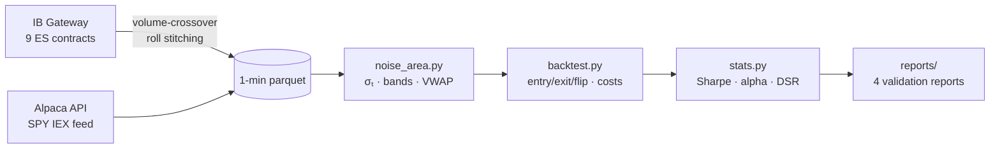

# 📈 "Beat the Market" replication — Intraday Momentum on SPY & ES

[](https://www.python.org/)
[](tests/)
[](#-data)
[](docs/CONCLUSIONS.md)

Independent replication and validation of **Zarattini, Aziz & Barbon (2024)** — *"Beat the Market: An Effective Intraday Momentum Strategy for S&P500 ETF (SPY)"* ([SSRN 4824172](https://papers.ssrn.com/sol3/papers.cfm?abstract_id=4824172)) — across **two instruments and two independent data sources**, with anti-overfitting protocols frozen ex-ante.

📌 **How this differs from my other public repos** — three distinct projects, not variations of one:

| Repo | What it is | Instrument · timeframe |
|---|---|---|
| **this one** | Replication of **Zarattini, Aziz & Barbon (2024)**, [SSRN 4824172](https://papers.ssrn.com/sol3/papers.cfm?abstract_id=4824172) — Noise-Area intraday momentum | SPY + ES · 1-min |
| [`qqq-opening-bias-5min`](https://github.com/giovannibrusco/qqq-opening-bias-5min) | Replication of a **different** paper: Zarattini & Aziz (2023), [SSRN 4416622](https://papers.ssrn.com/sol3/papers.cfm?abstract_id=4416622) — opening-range bias | QQQ · 5-min |
| [`nq-intraday-breakout`](https://github.com/giovannibrusco/nq-intraday-breakout) | Original strategy, not a paper replication | NQ |

> 🇮🇹 Italian version of this README: [`docs/README.it.md`](docs/README.it.md).


## 🎯 TL;DR

| | Result | Benchmark |
|---|---|---|
| ✅ **Replication successful** | Sharpe **1.11**, alpha **+16.7%**/yr (t 2.85), beta ≈ 0 | paper: 1.33, ~19.6% (2007-24) |
| ✅ **Trade-level in line** | +2.6 bps/trade, WR 41%, payoff 1.69 | Quantitativo on ES: +2 bps, 36%, 2.1 |
| ✅ **Cross-validation** | ES (IB futures) vs SPY (Alpaca): correlation **0.97** | same signals, two data worlds |
| ⚠️ **Edge compressed since 2025** | recent Sharpe ≈ 0 on *both* instruments | not the feed, not the costs |
| 🔒 **Optimisation does not save it** | 27-variant grid: the paper's config wins; walk-forward: **destroys** value | ex-ante protocols in [`docs/`](docs/) |

> **Summary judgement**: a real strategy in-sample, with a valuable profile (beta 0, pays in crises — 2022: **+25.8%** with SPY at -19.5%), but with a currently compressed edge. Not allocable today, not dismissible as dead either: full verdict in [`docs/CONCLUSIONS.md`](docs/CONCLUSIONS.md).

## 📐 The strategy in 30 seconds

Intraday momentum conditioned on a **"Noise Area"**: bands around the open built from the typical move of the last 14 days *at each minute of the session*, anchored to `max/min(Open, previous Close)` to handle overnight gaps. Price inside the bands = noise, no trade. A breakout at a 30-minute check → trend-following with a trailing stop on VWAP/bands, forced flat at 16:00. Vol targeting 2%/day, max leverage 4×.



## 📊 The key results in four charts

### 1 · The edge was there, and it compressed


2020-2024: Sharpe 1.4–2.0 every year, alpha 23-28%. Then two years below zero. 2022 is the signature of the "long volatility" profile: the strategy makes money precisely when the market breaks down.

### 2 · The recent decline is real — not a data artefact


The same strategy on **ES** (CME futures via IB, real VWAP and volumes, continuous contract built with a volume-crossover roll) and on **SPY** (free IEX feed): returns correlated at **0.97**, same outcome. Feed, costs (~0.4 bps/round trip) and stitching are all ruled out. → [`reports/validation_es.md`](reports/validation_es.md)

### 3 · It is not a parameter problem


Maróy's (2025) follow-up claimed Sharpe >3 by optimising the parameters. Redone **with discipline** (protocol frozen [before the results](docs/PROTOCOL_MAROY.md), mechanical selection, Deflated Sharpe Ratio): the in-sample winner of the 27 variants is… **the paper's original configuration** (final / 14d / 30min, boxed). No variant promoted. → [`reports/maroy_experiment.md`](reports/maroy_experiment.md)

### 4 · Nor is it adaptivity: the walk-forward destroys value


Quarterly reselection of the best variant on trailing 252-day Sharpe: **Sharpe 0.57 vs 0.92** for the fixed config, 14 switches out of 19, and the best full-sample config is not selected *in a single quarter* — the 1-year ranking among correlated variants is noise. → [`reports/walkforward_experiment.md`](reports/walkforward_experiment.md)

## 🗂 Structure

```
├── src/
│   ├── noise_area.py        # σₜ, gap-anchored bands, session VWAP
│   ├── backtest.py          # event-driven engine: entry/exit/flip, equity+futures costs
│   ├── sizing.py            # 2% vol targeting + 4× leverage cap (frozen parameters)
│   ├── stats.py             # Sharpe, alpha/beta, trade stats, Deflated Sharpe Ratio
│   ├── download_alpaca.py   # SPY 1-min (IEX feed, free)
│   ├── download_ib.py       # ES 1-min: quarterly contracts + stitching + back-adjustment
│   ├── validate_data.py     # data sanity checks
│   └── run_{validation,maroy,walkforward}.py   # reproducible pipelines → reports/
├── tests/                   # 48 tests on synthetic data (σₜ, gaps, flips, exits, stitching…)
├── reports/                 # results: SPY validation, ES, Maróy, walk-forward
├── docs/                    # SPEC, frozen ex-ante protocols, CONCLUSIONS
├── scripts/make_charts.py   # regenerates the README charts (light/dark themes)
└── data/                    # ES roll table + VIX (1-min parquets are rebuilt by the scripts)
```

## 🚀 Quickstart

```bash
pip install -r requirements.txt
python -m pytest tests/                      # 48 tests, synthetic data (no external data needed)

# 1 · Get the data — raw 1-min files are NOT in the repo (IB/CME and Alpaca ToS)
export ALPACA_API_KEY=... ALPACA_SECRET_KEY=...          # free paper account
python -m src.download_alpaca --symbol SPY --start 2016-01-01   # SPY, free
python -m src.download_ib --port 4001                          # ES, needs IB Gateway + CME sub

# 2 · Reproducible validation pipelines → reports/
python -m src.run_validation && python -m src.run_maroy && python -m src.run_walkforward

# 3 · ES backtest (after download_ib)
python - <<'PY'
import pandas as pd
from src.backtest import run_backtest, CostModel
from src.stats import performance_summary, trade_stats

bars = pd.read_parquet("data/es_1min.parquet")
res = run_backtest(bars, exit_mode="final", costs=CostModel.es_futures(0.25),
                   unit_multiplier=50.0, initial_equity=1_000_000.0)
print(performance_summary(res.daily_returns))
print(trade_stats(res.trades, unit_multiplier=50.0))
PY
```

## 📚 Data

| Source | Instrument | Period | Notes |
|---|---|---|---|
| Interactive Brokers | ES futures, 1-min | May 2024 → Jul 2026 | 9 quarterly contracts, volume-crossover roll, additive back-adjustment ([roll table](data/es_1min_rolls.csv)) |
| Alpaca (IEX, free) | SPY, 1-min | Jul 2020 → Jul 2026 | ~3% of consolidated volume: approximated VWAP (validated against ES: immaterial) |
| CBOE | VIX daily | 1990 → today | tables by volatility regime |

> ⚠️ **The raw 1-minute files are not redistributed** (IB/CME and Alpaca ToS): they are rebuilt with `download_ib.py` (ES, needs an IB account + CME subscription) and `download_alpaca.py` (SPY, free paper key). The repo only ships the ES [roll table](data/es_1min_rolls.csv) and the VIX series (redistributable from CBOE).

## 🧭 Anti-overfitting method

All the replication parameters are **frozen by spec** (14-day lookback, 30-min checks, 2% vol target, 4× leverage). Every experiment beyond the replication followed the same ritual, verifiable in the git history:

1. 📝 **Protocol frozen and committed before any result** (closed list of variants, success criteria, mechanical selection rules)
2. 🧪 Run once, out-of-sample evaluated once
3. 📉 Correction for multiple testing (Deflated Sharpe Ratio, Bailey & López de Prado 2014)
4. 📢 Publication of *all* results, failures included

## ⚠️ Disclaimer

Personal research project for educational purposes. Nothing here is financial advice; past results (and paper replications) do not predict future returns. The recent sample shows a compressed edge: read [`docs/CONCLUSIONS.md`](docs/CONCLUSIONS.md) before drawing any operational conclusion.
